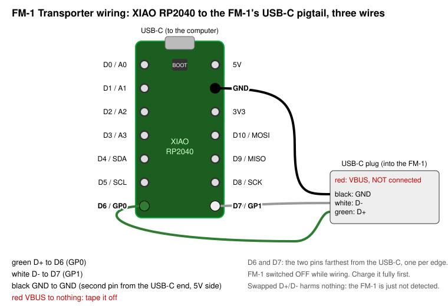

# Recovering a dark FM-1 with the FM-1 Transporter (the hardware route)

This is the route for an FM-1 that shows **no USB device at all**: not the `WL82 UBOOT1.00` disk,
not the `FM-1` MIDI device, not `ota-FM-1`, nothing, in any mode, on any cable. `fm1_unbrick.py`
cannot reach such a unit. A Seeed XIAO RP2040 wired to the FM-1's USB data lines can: at
power-on it sends the chip's USB_KEY sequence, which forces the mask-ROM UBOOT whatever is in
flash, and then exposes the flash to the computer. The board and its firmware are Leo Kuroshita's
[FM-1 Transporter](https://github.com/kurogedelic/FM-1-transporter) (MIT). This guide is the
procedure that brought the author's unit back on 2026-10-09, with the parts used, what the flash
dump showed, and `fm1_transporter_recover.py`, which automates it.

> Unofficial. At your own risk. Read the [rules](#rules) first. Nothing here writes below
> `0x4000`, and nothing is written before a double-read, compared, saved dump.

## The short version (no toolchain, no expert needed)

1. Buy the two parts below; charge the FM-1 fully.
2. Download `FM-1.fwsc` (the official V15) from <https://www.m-vave.com/download>.
3. In this folder:
   ```sh
   python3 fm1_transporter_recover.py setup      # fetches the JieLi loader, builds the Transporter firmware file, installs pyserial
   python3 fm1_transporter_recover.py wizard --v15 FM-1.fwsc
   ```
   The wizard tells you, step by step, when to plug in the XIAO, how to wire it
   ([picture](transporter/xiao-wiring.svg)), when to switch the FM-1 on, and asks you to type
   `WRITE` before the one step that changes the FM-1. Everything it does is also available as
   separate commands (below) if you prefer to go one step at a time.
4. When it says done: switch the FM-1 off, remove the three wires, switch it on. It boots stock
   V15. Install whatever firmware you want the normal way, on a full battery.

No part of this needs a compiler: the Transporter firmware ships prebuilt in `transporter/`
with a placeholder where JieLi's loader goes, and `setup` splices the loader in from
jl-uboot-tool and checks every hash ([transporter/README.md](transporter/README.md)).

## How a unit gets here

ChoralRoot's installer (a Felucca-family update loader, the same one Felucca uses) writes the app
area `0x4000..0x92FFF` sector by sector over USB-MIDI. The author's install stopped at
"the loader was disconnected after 274 requests" (of about 1167): the chip reset or lost USB
mid-write (a battery brown-out is the usual suspect: the FM-1 updates on its battery, even on
USB). After that: black screen, no USB device in any mode, on a Mac and on Windows; the OCT-/OCT+
hold, two minutes switched on, three quick restarts and an hour of charging changed nothing.

The dump later showed why nothing could help from the outside (see [What the dump showed](#what-the-dump-showed)).

## Parts

| part | used | notes |
| --- | --- | --- |
| Seeed Studio XIAO RP2040, pre-soldered headers | <https://www.amazon.com/dp/B0DRNTQ338> | RP2040 only. Not the RP2350 (its GPIO erratum and D+ pull-up break the Transporter) |
| USB-C male to 4-pin Dupont pigtail (red V+, white D-, green D+, black GND) | <https://www.amazon.com/dp/B0G1358FPH> | plugs into the FM-1's USB-C port; three of its four wires go to the XIAO |
| a normal USB-C data cable | | XIAO to the computer |
| a multimeter (optional, recommended) | | to confirm the pigtail's colours against the plug before wiring |

## Wiring: three wires, VBUS not connected

| XIAO RP2040 pin | FM-1 USB | pigtail wire |
| --- | --- | --- |
| **D6** (GP0) | D+ | green |
| **D7** (GP1) | D- | white |
| **GND** | GND | black |
| nothing | VBUS (5 V) | red: tape it off |



"D6" is the label printed on the board; it is GPIO 0 on the chip, which the Transporter firmware
calls `pin_dp = 0`. D6 and D7 are the two pins farthest from the XIAO's USB-C connector, one on
each edge. GND is the second pin from the USB-C end on the 5 V side. The pigtail's pins slide out
of their housing so each can go onto its header pin. Swapped D+/D- damages nothing; the FM-1 is
simply not detected. The FM-1 runs on its battery during all of this: **charge it fully first**.

## Build and flash the Transporter

**You do not have to build it.** `python3 fm1_transporter_recover.py setup` produces
`transporter/fm1_transporter.uf2` from the prebuilt placeholder firmware in this repository and
the loader it fetches from jl-uboot-tool (every hash checked; see `transporter/README.md`). Then
`flash-xiao transporter/fm1_transporter.uf2`, or let the wizard do it. The rest of this section
is for building it from source.

You need pico-sdk 2.2.0 (`git clone -b 2.2.0 https://github.com/raspberrypi/pico-sdk ~/pico-sdk`,
then `git submodule update --init` inside it), CMake, an Arm GCC toolchain, and `wl82loader.bin`
from [jl-uboot-tool](https://github.com/kagaimiq/jl-uboot-tool) (`data/loaderblobs/usb/wl82loader.bin`,
24064 bytes, sha256 `d41da612…`, the same file `fm1_unbrick.py setup` fetches). picotool is not
needed.

On an Apple-silicon Mac without Rosetta, Homebrew's `arm-none-eabi-gcc` bottle has **no newlib**
(the build stops at `cannot read spec file 'nosys.specs'`). Use Arm's own toolchain tarball
instead (`arm-gnu-toolchain-14.2.rel1-darwin-arm64-arm-none-eabi.tar.xz` from
developer.arm.com; check its `.sha256asc`) extracted to `~/arm-gnu-toolchain-14.2`, and put its
`bin` first on `PATH`. The cask `gcc-arm-embedded` is the same thing as a `.pkg` installer.

```sh
git clone https://github.com/kurogedelic/FM-1-transporter
cd FM-1-transporter
git submodule update --init
cmake -S . -B build -DPICO_SDK_PATH=$HOME/pico-sdk -DPICO_BOARD=seeed_xiao_rp2040 \
      -DFM1T_LOADER_BIN=/path/to/jl-uboot-tool/data/loaderblobs/usb/wl82loader.bin
make -C build -j8
```

`build/fm1_transporter.uf2` is the result (about 210 KB). Check that the loader was embedded:
the configure step prints `FM-1 Transporter: embedding …wl82loader.bin`, and `build/generated/wl82loader.h` exists.

Flash it: plug the XIAO into the computer. If it shows up as a `RPI-RP2` disk, copy the `.uf2`
onto it. If instead it shows up as a serial port (a fresh XIAO runs a blink sketch and does),
either hold its BOOT button while plugging it in, or let the script do the "1200-baud touch":

```sh
python3 fm1_transporter_recover.py flash-xiao /path/to/FM-1-transporter/build/fm1_transporter.uf2
```

The board reboots as **FM-1 Transporter** (USB `2E8A:000A`) with two serial ports: the first is
a console that prints `KEY: n packets` while it waits for the FM-1; the second is the data port
the scripts talk to. The data port answers `ping` at once but every other request waits until
the FM-1 has answered the USB_KEY: that is normal.

## The procedure

Everything below needs pyserial (`pip3 install pyserial`) and, for `restore` / `recover`, the
`.fwsc` package you want on the unit. The official V15 `FM-1.fwsc` from M-VAVE is the one to write
first (hash-checked, see README); a Felucca-family package such as ChoralRoot's is installed
afterwards through its own installer, once the unit is alive.

1. FM-1 **switched off**. Wire it to the XIAO as above. XIAO to the computer (it starts keying
   straight away). Switch the FM-1 **on**: the order matters, the key must be on the lines when
   the chip powers up. If the XIAO was already plugged in for a while, unplug and replug it first
   so it keys from a clean start.
2. `python3 fm1_transporter_recover.py info` waits for the data port and prints the chip:
   `OK key=980F type=3 id=856014` is an FM-1. Not detected: swap D+/D-, shorten the wires, check
   the charge, read the console port, try `python3 fm1_transporter_recover.py rekey` (the
   Transporter reboots into USB_KEY mode) and switch the FM-1 off and on again.
3. `python3 fm1_transporter_recover.py dump backups --v15 FM-1.fwsc` reads the whole 1 MiB twice,
   compares the two reads, saves the dump and prints the analysis (next section). **Keep the dump.**
   It holds the user data of the unit as well as the evidence of what went wrong.
4. `python3 fm1_transporter_recover.py restore FM-1.fwsc --ref backups/<dump>.bin --verify-v15`
   is a dry run: it re-reads the flash, checks that it still equals the dump, and lists the
   sectors it would write. Then the same with `--write`, type `WRITE` when asked. Every sector is
   erased, written and read back by the Transporter; a final full read is compared with the
   expected image.
5. Switch the FM-1 off, unplug the three wires, switch it on. It boots stock V15 with a live
   screen and shows up as `FM-1` on USB. Then install whatever firmware you wanted the normal way,
   **on a full battery, with the computer kept awake** (`caffeinate -dimsu` on a Mac), with the
   Transporter within reach.

`recover FM-1.fwsc` runs 2, 3, the dry run and the write in one go, stopping for the typed
confirmation. Every command has `--dry-run`, which drives an in-memory mock Transporter instead
of a serial port; `--mock-flash DUMP.bin` seeds the mock from a real dump, which is how the flow
was rehearsed before the real write.

## What the dump showed (the author's unit, 2026-10-09)

The two reads were identical (sha256 `6c075920…`). Against the V15 package and the two
ChoralRoot builds involved (the one being installed, rebuilt from its commit, and the one that
was on the unit before):

| region | finding |
| --- | --- |
| `0x0000..0x3FFF` (SPL) | byte-identical to the V15 package's head |
| `0x04000..0x24FFF` (33 sectors) | the **new** package, bit-exact |
| `0x25000..0x92FFF` (110 sectors) | the **old** firmware, fully programmed |
| last sector written | `0x24000`; **no torn sector**: every sector was fully programmed from one source or the other, so the loader died between finishing one sector and erasing the next. 33 sectors is exactly the 274 requests (8 reads of 512 bytes per 4 KiB sector) |
| `0xE0000..0xE4FFF` | the staged update loader **intact**: header CRC valid, body byte-identical to the built loader, its `FELUCCA-LOADER-1` marker present |
| `0xE4F00` | the update record **present and valid**: CRC correct, magic `0x5441`, identity `ota-FM-1_015`, loader area `0xE0000` |
| `0x93000..` | the Felucca-family data objects untouched (settings, user sounds, patch stores); leftovers from stock at `0xE8000` and `0xFA000`; an older staged-loader header at `0xE6000`; the loop area erased |

So everything the loader's power-loss resume depends on was in flash and valid, and still the
unit produced no `ota-FM-1` on any power-on. The conclusion: **the SPL does not start the loader
from the flash record at `0xE4F00` on a cold boot.** The only hand-over to the loader that is
known to work is the record in RAM, which a power cycle clears. The chip jumped into an app whose
first 33 sectors were new and whose remaining 110 were old, and hung before any of that app's
own safety code (watchdog arming, boot guard, the OCT hold) ever ran. A unit in this state cannot
be reached from the outside without the Transporter; "leave it on", holds and quick restarts do
nothing, because none of them run.

For firmware authors, the consequences are in ChoralRoot's `docs/BOOT-SAFETY.md`: a boot stub in
the first app sector that validates the body before jumping, and a loader write order that
leaves every interruption in a state the stub turns into a rescue.

## Rules

- **The boot head `0x0000..0x3FFF` is never written.** The Transporter firmware refuses it, and
  so does the script. A package whose head differs from the unit's is reported, and only
  `0x4000..0x92FFF` is written.
- **No chip erase, no block erase.** Only whole 4 KiB sectors in `0x4000..0x92FFF`, each erased,
  written and read back.
- **A double-read, compared, saved dump before any write.** The write re-reads the flash and
  refuses if it no longer equals the dump it was told to trust.
- **The chip key must be `0x980F` and the flash ID `0x856014`.** No override.
- **Never flash anything that has not passed the checks**: the official V15 by its region hash,
  or a Felucca-family package the parser accepts.
- **A full battery**, before the Transporter session and before the install that follows.
- VBUS stays disconnected.

## Credits

- **Leo Kuroshita (kurogedelic) / Hügelton Instruments** for the
  [FM-1 Transporter](https://github.com/kurogedelic/FM-1-transporter): the board firmware,
  the USB_KEY recovery and the line protocol that `fm1_transporter_recover.py` speaks.
- **kagaimiq** for [jl-uboot-tool](https://github.com/kagaimiq/jl-uboot-tool), whose wl82 USB
  loader the Transporter embeds.
- The r/MVaveFM1 thread and u/acrawf1's guide, which pointed at the Transporter for the
  "nothing on USB at all" case.
